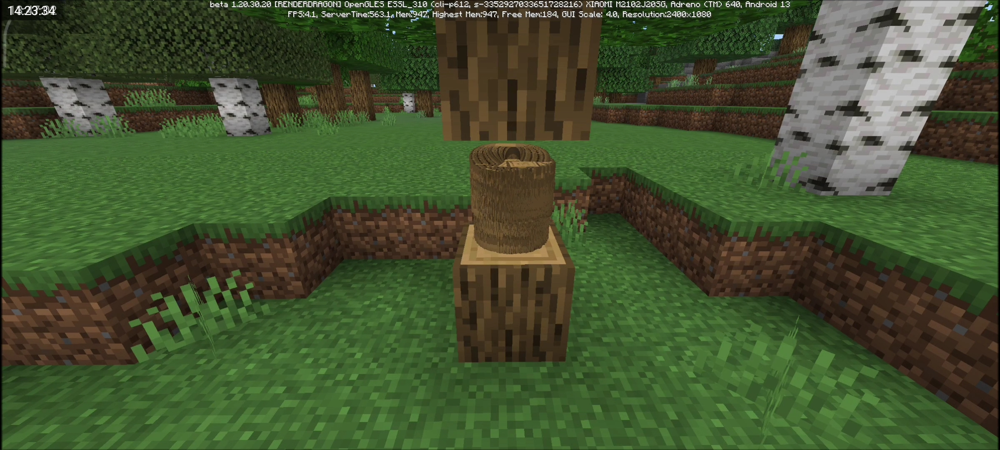
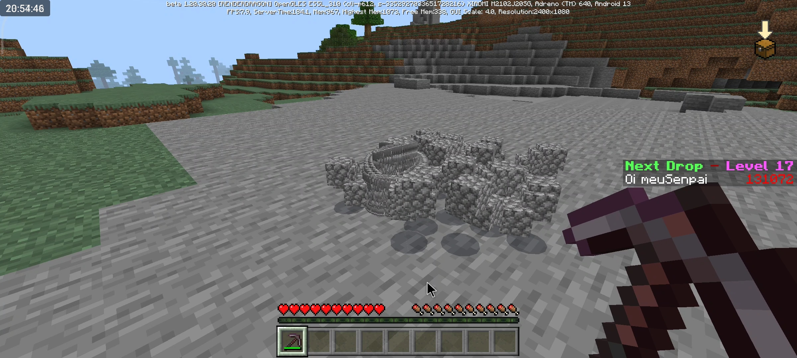
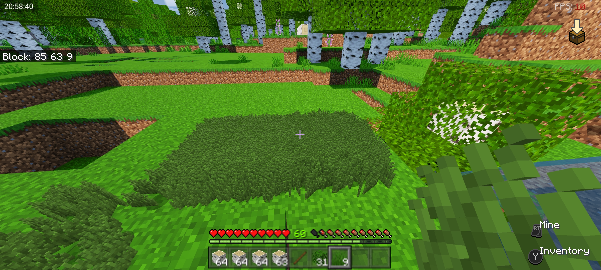
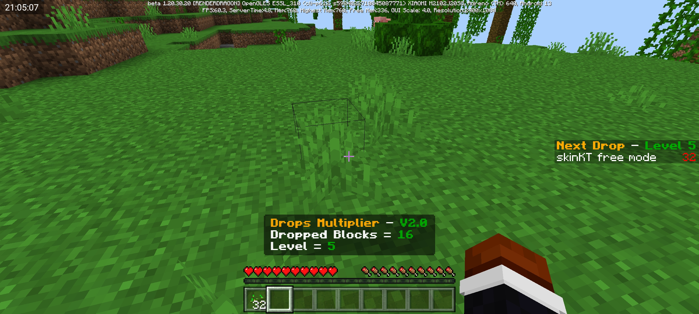
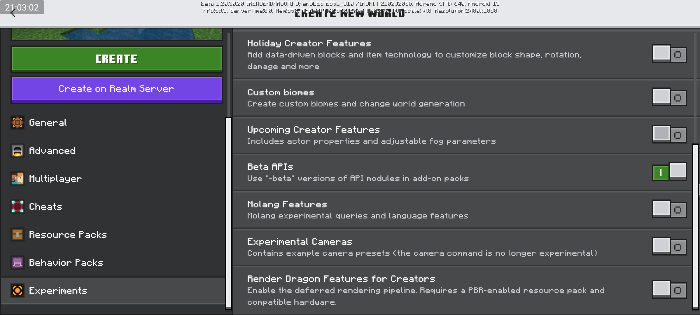

# • Drop Multiplier V2

**Drop Multiplier V2** mod is a script for mcpe 1.20.30+ that will be executed whenever you, or other participants in the world break a block, thus making the blocks drops are multiplied every time a block is broken!

## • Descripition

The mod works as follows: When creating a world, a multiplication counter will also start with the initial value equal to 1, this way the drop of items and blocks will be multiplied according to this counter.

Each time any participant in this world breaks a block, the counter will be multiplied by 2, and can be multiplied infinitely.

It sounds like an easy challenge, but when the multiplier reaches very high proportions, you will understand the real challenge of this mod.

## • New Accountant

Now the Drop Multiplier in its V2.0 version, unlike its predecessor that had nothing to signal how much the multiplier is, this one has 3 different counters for you to stay tuned in your progress in the mod.

There will be 1 counter in the pause menu and another 2 on the game screen, one of them being in the right corner of the screen showing the current level and the next amount of blocks that will be discarded, the other will appear whenever someone in the world breaks a block, signaling the accomplished level and the amount of discarded blocks.

## • Experimental Functions

When creating the world where this mod will be hosted, there will be some conditions to follow for the mod to work correctly.

When creating the world, go down to the experimental functions tab, and look for the 'Beta APIs' option and activate it.

## • Bugs And Errors

As much as the mod is well crafted and very well done, there are still some bugs and errors contained in it, I will mention some of them below.

- When a multiplication counter is started it ends as soon as the world is closed, restarting whenever the world is reopened.

- Some blocks are not registered in the base code of the script, so there may be errors in drops.

Bugs and errors recorded so far are just those, if you find another error, let the creator know so they can be resolved!!

## • License

This mod took a lot of work to do, so if you want to spread something about this mod, **post/tag the official link of the mod from [MCPEDL](https://mcpedl.com/drops-multiplier-v2-0/) or [GitHub](https://github.com/Pv3Moddz/Drops_Multiplier_V2.0/)**, if possible tag the [creator](https://github.com/Pv3Moddz/Drops_Multiplier_V2.0/#-mod-credits) of the mod.

## • Mod Credits

This mod was fully created, tested, recorded and published by [Pv3Moddz(me)](https://youtube.com/pv3zin), all in order to be able to present something that can amuse the community of minecraft players.

- My primary channel (programming): [@Pv3Moddz](https://youtube.com/@Pv3Moddz)
- My secondary channel (games): [@pv3zin](https://youtube.com/@pv3zin)

## • Download

After downloading the mod from the link below, open your file manager in the "Downloads" folder and search for the downloaded content, when you find it, rename the files and only remove the ".zip". If you don't know how to add the mod to your mine, see the [video of the mod on YouTube](https://youtu.be/HU-xft0W5TI).

- Download Mod: [Drops Multiplier V2.0 ( mcpe 1.20.30 )](https://www.mediafire.com/file/giivly4b7tckfc3/Drops_Multiplier_V2.0.mcpack.zip/file)

**For link errors, notify the creator**
